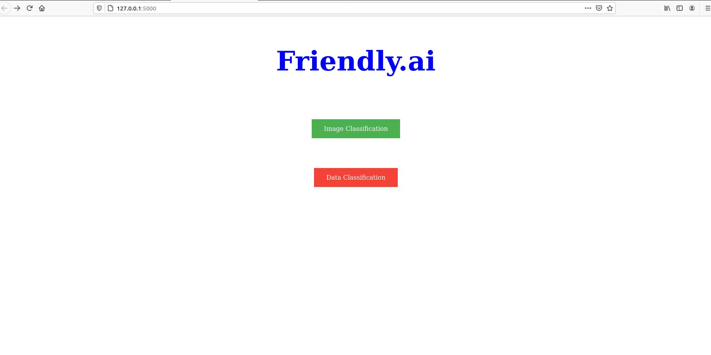
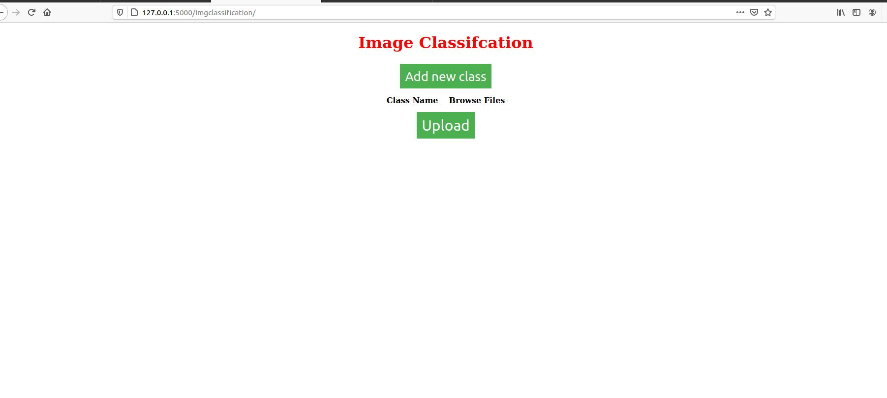
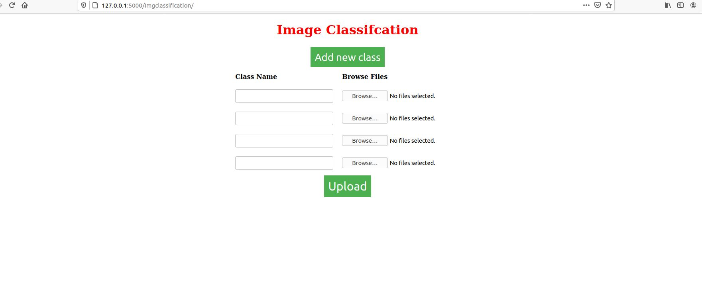
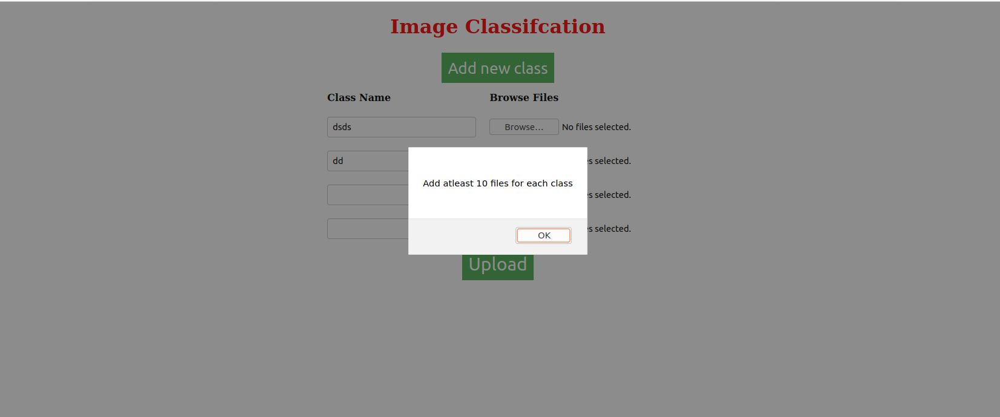
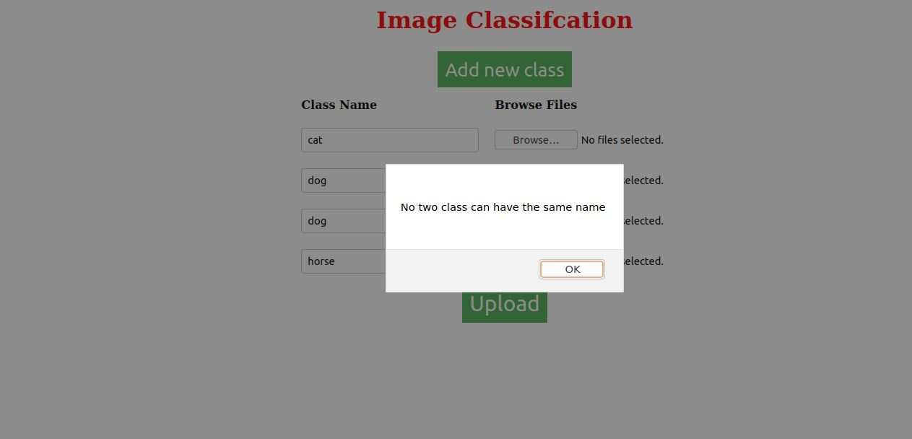
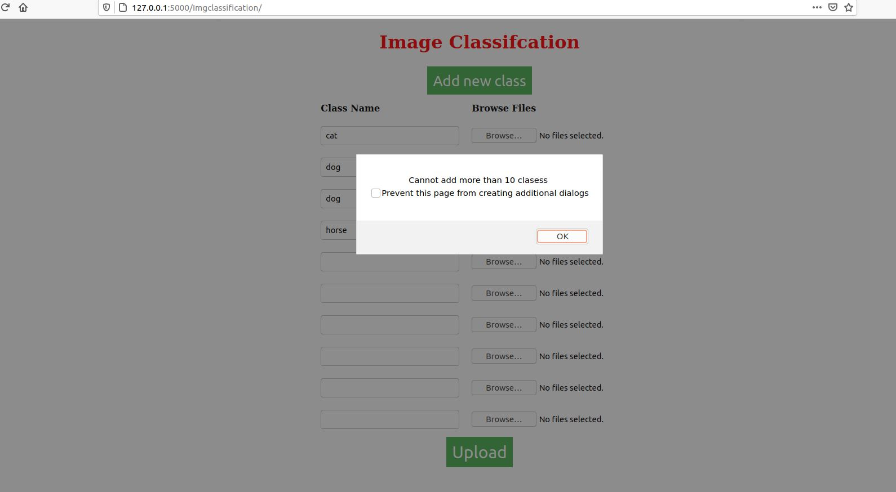

# Friendlyai
This is being delveloped as a part of Eva4 Phase 2 assignment.
Idea is to develop a clone of https://lobe.ai/ which facilitate creating of easy ML models for deployment.
## Features of Current UI implentation
- This UI is capable of taking class name and files as input.
- Using Add button in the UI user can add upto 10 clasess .
- If user is pressing upload button without adding atleast 2 clasess it will throw error.
- If user is trying to add more than 10 clasess UI will pop up and error message.
- If user is trying to upload images less than 10 on each class or more than 100 on each class UI will throws an error alert.

## UI Screenshots

